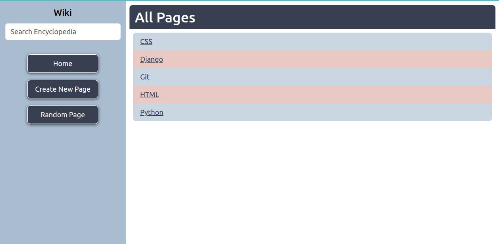

# Wikipedia-Like

A Django app that stores and displays encyclopedia entries using Markdown. A CS50W course project.


## Installation

Clone the project, which can be done by running the command below:

```bash
git clone https://github.com/webshuriken/wikipedia-like
```

You willl also need at least Python v3 installed. You can find the latest version on the [Python official site](https://www.python.org/downloads/).

```bash
# check your version of Python
python --version
```
## Features

- Read any encyclopedia entry stored in the app.
- Make changes to any encyclopedia entry.
- Create new entries using Markdown.
- Search for entries by using the search bar.
- Load a random encyclopedia entry.

## Tech Stack

- Django framework
- Python 3.6
- Pip
- CSS3
- HTML5

## Screenshots



## Color Reference

| Color             | Hex                                                                |
| ----------------- | ------------------------------------------------------------------ |
| Charcoal |  #373F51 |
| Powder Blue |  #A9BCD0 |
| Light Powder Blue |  #CAD6E2 |
| Melon |  #DAA49A |
| Light Melon |  #E9C9C3 |
| Moonstone |  #58A4B0 |
| Warning |  #ff0000 |


## Key Takeaways

This was my first Django App and it was really fun to create. As with anything new there was a learning curve but it was mainly getting used to the structuring of the framework and also finding out all the amazing things it can do.

Another takeaway is that the framework can do a lot and it will take time to get to know it well. There is built in support for forms which was fantastic. It allows you to create tokens to help prevent CSFRs and you can also add user input verification on the backend.

For the project I created a Markdown to HTML parser. Although basic, in its current stage, it can process heading, unordered list items at different levels, bold text, and links. It was an interesting challenge that helped me to gain more experience with Python.

## Roadmap

### Wiki App

- Connect to an External DB

- Add Auth so only registered users can edit or add entries

### Markdown to HTML

- Support for ordered lists

- Support for tables
## Acknowledgements

 - [CS50](https://pll.harvard.edu/course/cs50s-web-programming-python-and-javascript?delta=0) for providing the base distribution code and lesson to go with it, thank you.
 - [Django Form Docs](https://docs.djangoproject.com/en/4.1/topics/forms/)
 - [Python regex docs](https://docs.python.org/3/howto/regex.html)
 - [Markdown Guide](https://www.markdownguide.org/)
 - [GitHub Markdwon Guide](https://docs.github.com/en/get-started/writing-on-github/getting-started-with-writing-and-formatting-on-github/basic-writing-and-formatting-syntax)
 


## Authors

- [CS50](https://pll.harvard.edu/course/cs50s-web-programming-python-and-javascript?delta=0)
- [Carlos E Alford](https://carlosealford.com/)


## License

[MIT](https://choosealicense.com/licenses/mit/)


## Optimizations

- Kept the app as accessible as possible.
- The form prevents CSRF and checks users input is valid.
